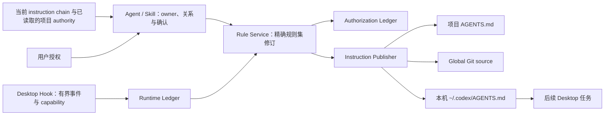
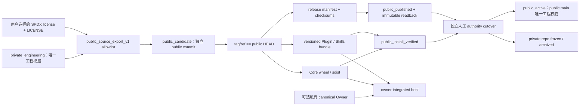

# Agent Memory L2 系统拓扑

- Status: active
- Owner layer: project_docs
- Applies when: 判断组件职责、调用方向、持久化、Desktop 宿主或跨设备分发边界。
- Avoid when: 只需要用户操作或字段定义；读取 [L3](interface.md)。
- Last verified: 2026-08-14
- Evidence: [L1](axioms.md)、用户批准的条件可见终态闭环设计、[Core v1 ADR](../decisions/0057-agent-memory-core-v1.zh.md)、[Runtime storage policy ADR](../decisions/0058-persistent-runtime-journal.zh.md)、[有界规则集演化 ADR](../decisions/0059-bounded-behavior-set-evolution.zh.md)、[周期性 Global Owner Scout ADR](../decisions/0060-periodic-global-owner-scout.zh.md)、[直接可见审阅包 ADR](../decisions/0063-direct-visible-owner-review-packs.zh.md)、[中文双投影审阅包 ADR](../decisions/0064-chinese-contextual-dual-projection-review-packs.zh.md)、[主机感知动态项目注册 ADR](../decisions/0065-host-aware-project-enrollment.zh.md)、[执行与可见输出完整性 ADR](../decisions/0066-scout-execution-and-visible-output-integrity.zh.md)、[生产执行源激活门禁 ADR](../decisions/0067-scout-production-source-activation-gate.zh.md)、[用户主动触发主路径 ADR](../decisions/0068-interactive-project-scout-primary.zh.md)、[跨设备冷启动连续性 ADR](../decisions/0069-cross-device-cold-start-continuity.zh.md)、[原子规则包 ADR](../decisions/0070-atomic-review-pack-rule-bundles.zh.md)、[所见即所签与物理 containment ADR](../decisions/0071-wysiwys-review-pack-bundles-and-physical-target-containment.zh.md)、[白名单公开分发 ADR](../decisions/0072-allowlisted-public-distribution-lane.zh.md)、[公开工程权威切换 ADR](../decisions/0073-public-engineering-authority-cutover.zh.md)

## 拓扑



## 单一所有权

| 组件 | 唯一职责 | 输入 | 输出 | 不负责 |
| --- | --- | --- | --- | --- |
| 用户 | 长期行为变化与规则集修订授权 | 完整提案、范围和精确 before/after | 明确确认、修改、忽略或撤销 | 文件、数据库或诊断 |
| Agent | 发现、概括、owner、适用性与规则关系判断 | 当前任务证据、实际 rules、当前已读取 authority、可选 Memories | `already_covered`、`add`、`replace`、`consolidate`、`route_to_owner`、无候选或普通任务结果 | 自行授权、自动删除、部署声明 |
| Skill | 会话流程、owner 前置检查、用户语言和终态呈现 | Agent 判断、当前 approval ref、实际 target 摘要 | 零或一次单规则或原子规则包 CLI 操作，以及机制参与后的一个最终回执或确认卡片 | 行为所有权、全项目扫描、后台循环 |
| Runtime Ledger | 有界 prompt event、session、proposal token | Hook event | hash/ref 与当前 scope | prompt 语义、规则正文 |
| Authorization Ledger | 一次性 approval 消费 | 当前 event、operation、规则集修订 hash | consumed 或明确拒绝 | 规则历史、行为状态 |
| Rule Service | payload、scope、容量和精确修订协调 | 七字段 payload、approval ref、target before hash、被替换 IDs | 原子规则集 mutation 计划或结果 | 语义重叠判断、owner 选择、Git push |
| Instruction Publisher | 单/双 target 文件事务、漂移与恢复 | 已授权规则集 | 可验证的 `AGENTS.md` | 授权、语义、远端发布 |
| Installation Registry | immutable runtime 与 global binding | setup/cutover | 当前 artifact/binding | 行为规则 |
| Hooks | `UserPromptSubmit` 与 compact 能力传输 | 原生事件 | `additionalContext` 或空输出 | proposal 正文、自动批准、规则查询 |
| `AGENTS.md` | 必须执行的长期规则 | Publisher 写入 | Codex instruction chain | 历史与分发 |
| 私有 Git | 完整 global 文档分发 | 本地 source commit | 可验证远端版本 | 本机生效与模型采用 |
| Memories | 可选背景 | 宿主策略 | 非强制背景 | must-apply 行为 |

## Store

Core Store 固定为七张表：

| 表 | Owner | 生命周期 |
| --- | --- | --- |
| `core_schema` | Core database | 单例、持久 |
| `prompt_events` | Runtime Ledger | 默认 7 天；只含 hash、字节数和有界 metadata |
| `runtime_sessions` | Runtime Ledger | 默认 7 天 |
| `proposal_tokens` | Runtime Ledger | 最长 24 小时；只保留 pending |
| `approval_consumptions` | Authorization Ledger | 与可验证 source event 同生命周期 |
| `runtime_installation` | Installation Registry | 单例、持久 |
| `global_instruction_binding` | Installation Registry | 单例、持久 |

禁止 `memories`、`memory_mutations`、`runbooks`、`runtime_deliveries` 和通用 `state`。短期文件事务恢复日志位于
Store 相邻目录，成功后删除；它只用于崩溃恢复，不是行为或历史权威。

## 外部项目复盘 workflow

Global Owner Scout 位于 Core 拓扑之外：

```mermaid
flowchart LR
    PR["连续性工程：Repo Anchor + Marketplace"] --> PL["Git-backed Agent Memory Plugin"]
    PL --> BS["Workstation Bootstrap Skill"]
    PR -.->|"plugin 未加载时 skill-installer"| BS
    GS["能力权威：Sidecar + Canonical Owner"] --> MS["$CODEX_HOME 受管 clean sources"]
    BS --> MS
    MS --> HM["Host materialization：Core / binding / Skills / Doctor"]
    HM --> IT["用户在目标工程新建 Worktree 任务"]
    IT --> EX["显式调用 $global-owner-scout"]
    EX --> NI["原生任务索引：yield / wait / terminal"]
    NI --> TP["相关自然任务分页到窗口边界或 EOF"]
    TP --> SS["Global Owner Scout Skill：project_scout"]
    SS --> PC["Immutable project_v4 Project Cards"]
    PC --> HC["Human Context：zh-CN 项目语境"]
    PC --> RPJ["Rule Projection：When / Do / Skip"]
    GB["Core global_instruction_binding"] --> OR["Deterministic Owner resolver"]
    GO["Canonical source 与本机 global target"] --> OR
    OR --> IP["Integration preview"]
    RPJ --> IP
    HC --> RP["Validated review_pack_v4"]
    IP --> RP
    RP --> DR["Deterministic renderer：interactive surface + 精确多选动作"]
    DR --> VO["Visible-output verifier：wrapper=0"]
    VO --> U["当前任务逐字可见；用户精确选择一张或多张"]
    U -->|"确认 card_id@selection_token 集合"| A["Fresh Owner 联合重算 + 所见即所签原子规则包"]
    RP -.-> CR["Sidecar 按需 central_review"]
    BS -.-> SE["可选 Scheduled Enrollment"]
    SE --> HAC["Host Activation Control"]
    HAC --> CP["临时 automation-source canary"]
    CP -->|"未终态/失败"| PB["scheduled production_blocked + PAUSED"]
    CP -->|"终态已证明"| ST["单项目 Scheduled canary"]
    ST -.-> NI
```



| 组件 | 唯一职责 | 不负责 |
| --- | --- | --- |
| Repo Bootstrap Anchor | 在连续性工程中识别统一部署意图，路由到插件/skill-installer/正式 Bootstrap | 复制 Bootstrap/Scout、保存主机状态、项目枚举、Owner |
| Agent Memory Plugin | 私有 repo marketplace 或公开 portable release 分发冷启动 Anchor | 完整实现、行为 Owner、Host Profile、自动项目启用 |
| Public Release Resolver | 解析 latest stable 或指定版本，验证 immutable Release、tag/commit、asset digest、checksums、manifest 与 portable | 回退 `main`、把 Marketplace 当 source authority、后台自动升级 |
| Managed capability sources | 在 `$CODEX_HOME` 保存 Sidecar 与 canonical Owner 的 clean、可重建安装快照 | 活跃项目工作区、任务历史、候选或第二 Owner |
| Workstation Bootstrap Skill | 同步受管源并物化 Core/global binding/Bootstrap/Scout/Doctor；只有用户明确要求 Scheduled 实验时才生成 Enrollment Pack 和调和 Host Profile | 把内容同步冒充主机激活、清理活跃工程、自动选择新项目、修改 Owner |
| Source Authority Cutover | 用 fresh `plan_hash` 显式替换存量主机受管 Sidecar identity，并在失败时恢复 source/Skill | 放宽普通 sync、隐式移除 Owner、修改项目 checkout 或 Scheduled |
| Deployment Pack | 以中文分层报告可移植分发、源同步、主机物化和项目激活 | 用前一层成功替代后一层、声称未验收的第二台设备成功 |
| Interactive Worktree Task | 在当前绑定项目承载 30 天手动复盘并把结果留在同一任务 | 隐式触发、修改活跃工作区、计入 Scheduled 14 次实验 |
| Project Discovery | 关联 Desktop 项目、自然任务、Git 内容 identity 与安全资格 | 根据固定项目名或路径决定启用 |
| Enrollment Pack | 用中文完整显示发现、活动覆盖、安全条件、现有状态和建议动作 | 未确认即创建 Scheduled Task |
| Host Profile | 保存当前主机的 enrollment 决策、内容 identity hash、host project/automation 映射与 cadence | 证据、候选、Review Pack、Owner 正文、跨主机租约 |
| Host Activation Control | 创建真实 automation-source canary、观察终态、调用宿主工具暂停/恢复任务并复读状态 | 项目证据、候选判断、Owner 写入、把 enrollment 冒充生产可用 |
| Capability canary | 在真实 Scheduled 来源只验证独立任务创建与原生任务索引终态 | Project Scout 深挖、卡片生成、长期任务、用普通任务替代生产入口 |
| Standalone Scheduled Task | 为一个已确认项目创建独立运行、绑定证据窗口和隔离 worktree | 复用活跃任务上下文、修改工作区、决定项目集合 |
| Native task execution | 以固定上限 50 请求索引；若 yield 则恢复同一 cell 到终态；以 turn limit 10、单项输出 20000 字符分页读取所有选中任务 | 用重复索引调用替代 wait、探测更大分页、把运行中解释为 unavailable |
| `project_scout` | 项目任务普查、事实重建、因果复盘、候选穷举、反证、抽象、证据等级与本地 owner 建议 | 授权、proposal、持久化候选、global owner 修订 |
| Project Card | 以 `project_claim_hash` 同时固定中文 Human Context、项目事实、因果、证据、抽象、Rule Projection 与本地 owner 判断 | global owner 写入、中央结论 |
| Human Context | 使用简体中文和脱敏项目业务语境解释真实事件、成本、建议、行为变化与最大风险 | 抽象规则写入、翻译后补、私有细节泄漏 |
| Rule Projection | 删除项目路径、命令、局部阈值和业务标识，形成精确 owner-ready `When / Do / Skip` | 充当用户确认界面、保存项目故事 |
| Integration preview | 在 Project Card 固定后读取最新 global owner，追加研究、语义关系、before/after 和动作资格 | 改写 Project Card、持久授权 |
| Deterministic Owner resolver | 从 Core Installation Registry 解析 canonical source，以活动 Codex home 的 global target 计算逻辑端点与 hash | 搜索项目根 Owner、猜测路径、输出物理路径或回退到项目 `AGENTS.md` |
| Project Review Pack | 将全部 E2/E3 卡渲染为中文分层 Markdown：警告、决策索引、30 秒判断、完整依据与技术附录 | 翻译或补写项目语义、原始 JSON 用户界面、跨任务传输、行为 owner |
| Deterministic renderer | 从 scripts 目录读取已验证 Review Pack；interactive 输出零 wrapper，scheduled 输出唯一末尾 wrapper | 动态导入、失败后手工重写、修复项目语义 |
| Visible-output verifier | 按 surface 重新验证正文 hash、卡片、动作、wrapper 数量和无尾注 | 生成卡片、判断候选、替代 renderer |
| Cache-free helper runtime | 以 `python -B` 运行 helper；Bootstrap 原子安装时排除 Python 字节码缓存 | 让 Scout 写入或自清理个人 Skill 缓存 |
| `central_review` | 在 Sidecar 当前任务中按需读取已经可见的 Review Pack，追加跨项目关系与并列注释 | Scheduled 自动摄取、隐藏来源卡、确认前置门禁 |
| Review draft | 为用户提供完整判断上下文 | `待确认` proposal 或长期状态 |

该链路不读写七表 Store，也不依赖 Scheduled Task 之间互相读取结果。交互与自动 Scout 的隔离快照前后必须一致；出现
diff、commit、push、外部写操作或无法证明的副作用时，该项目整包失败。活跃原工作区的并发变化只限定当前快照
覆盖范围，不得让稳定隔离快照中的其他候选整体失效。

原生任务调用返回运行中 cell 时，Scout 必须恢复同一 cell 到终态，且终态前不得发起第二次索引调用。Project 与
Review Pack 结构通过校验后仍未完成链路；只有 renderer 成功并且最终可见输出 verifier 证明正文、卡片、动作和
surface-specific wrapper 数量守恒，该次结果才完成呈现。verifier 是最后一个工具调用；之后不得执行独立 memory 审计
或追加尾注。

Bootstrap 1.7.0 先通过 Repo Anchor 或 Git-backed plugin 的 Release Resolver 验证不可变第一跳，再按 source manifest 把 Sidecar 与可选
canonical Owner 同步到当前
Codex home 的受管 clean sources。两个源必须全部完成 staged clone、remote identity、clean worktree 与 commit
校验后再替换受管目标；任何受管源 identity 漂移或 dirty 都失败关闭。该过程不得 pull/reset/clean 任何 Desktop
项目。随后才从受管源运行 Core setup、global binding、Doctor，并原子安装 Bootstrap/Scout。新安装能力只从下一
任务保证加载。相同主机空 CODEX_HOME 验收和真实第二设备验收分别报告，不得互相替代。

普通 `sync-sources` 不拥有 identity 换源能力。存量主机从历史 Sidecar 切换到公开权威时，只能使用 Source Authority
Cutover v1：dry-run 解析目标 ref、读取 clean 当前状态并生成不含路径/URL 的 plan；apply 重算并消费 exact hash，
保持已配置 Owner 或在真正无 Owner/binding 时进入 public Core。任一 source、Core setup、Doctor 或 Skill 安装失败都
恢复切换前状态。

Bootstrap 安装并验证 Skill 后，交互入口不需要 Host Enrollment。只有用户明确要求 Scheduled 实验时，Bootstrap
才为用户确认的 `active + eligible` 项目建立 Host Enrollment。`active` 来自滚动 30 天自然用户任务，
Scout、测试、自动化和委派任务不计入；`eligible` 要求 Git worktree 隔离。来源识别不足时显示 `bounded /
建议试运行`，非 Git 项目保持可见但不创建周期任务。Enrollment 后任务默认保持暂停，直到同一主机的真实
automation-source canary 在 180 秒外部观察预算内取得原生索引终态。canary 不通过时 Host Activation Control
复读任务为 `PAUSED` 并报告 `production_blocked`；只读 Scout 不负责自暂停。

三个用户创建的普通 worktree canary 分别验证交互 Skill、Schema、renderer、只读边界与同任务动作；通过后只提升
`interactive_project_scout`。它们不拥有 Scheduled 恢复权，也不计入 Scheduled 14 次实验。automation-source canary
通过后仍只恢复一个项目，直到一条 Scheduled Review Pack 与用户动作成立，才恢复其他 enrollment 项目。

交互任务继承当前任务的 model、reasoning 和 Speed；其触发语不要求用户填写资源配置。每个 Scheduled 确认项目在
14 次有效运行期间显式固定 `gpt-5.6-sol` + `medium`；speed/service tier 不单独持久化，直接
继承本机 Codex 当前配置。结果直接进入 Scheduled 收件箱，正常结果不得使用仅失败提醒。每个项目独立累计；
另一项目或按需中央审阅失败不得清零其计数。共享源与 Anchor 不保存固定项目名、绝对路径、host `projectId`、automation ID
或运行计数；同一 Git 内容 identity 可以在不同主机映射为不同 Host Enrollment。

## 数据流

### Candidate admission

```text
任务中出现可复用行为信号
-> Agent 读取实际 global/project rules
-> 只检查当前 instruction chain 与项目 router 已要求读取的 owner
-> 分类 already_covered / add / replace / consolidate / route_to_owner
-> already_covered 与 route_to_owner 不创建 proposal token，但在本轮已进入 Agent Memory 时返回可见终态
-> replace 或 consolidate 展示精确 before/after
-> 只有需要 managed-block mutation 时进入授权与发布
```

不得为了 admission 自动扫描整个项目、建立后台治理循环或把模型分类持久化。分类只决定本轮是否提出修订；
实际行为状态仍只来自 `AGENTS.md`。

### 会话终态

```text
普通、未审计、无候选 -> 不进入 Agent Memory -> 完全静默
用户审计 / 明确记住 / Agent 识别并公开候选
-> 先完成当前任务
-> Skill 检查实际规则并完成一次分类
-> 执行零或一次确定性 CLI 操作
-> 最终答复尾部呈现且只呈现一个真实终态
```

过程 commentary、能力传输和 CLI 调用开始都不是终态。宿主若要求在使用 Skill 前公开说明，只能在当前任务
完成后简短说明，并立即继续到分类、动作和最终终态；不得停在“稍后会记住”的承诺上。终态分类不写 Store，
因此不改变七表拓扑。

### 显式规则

```text
current UserPromptSubmit
-> Agent 生成完整七字段 payload 与修订关系
-> Rule Service 校验 event/session/scope/target、before hash 与被替换 IDs
-> Authorization Ledger 确认 ref 未消费
-> Instruction Publisher 原子写入完整修订后规则集
-> approval consumption 与文件结果提交
-> 重新解析实际 target
-> 返回生效或明确失败
```

### Review Pack 原子规则包

```text
current UserPromptSubmit selects exact card_id@selection_token pairs
-> target-scoped Fresh Owner/parity read
-> Agent jointly recomputes selected relations and aggregate before/after
-> Rule Service recomputes tokens and exact canonical confirmation text
-> Rule Service binds unordered rule_revision_bundle_v2
-> Authorization Ledger consumes the current ref once for the bundle
-> Instruction Publisher atomically writes the complete selected set
-> any item failure restores all target bytes and leaves approval unconsumed
-> one per-item bundle receipt
```

未选择 Project Cards 仍由原 `project_claim_hash` 固定；只有 integration preview 需要在以后选择时 rebase。Owner
或 target before 变化会使旧 token 失效，但不会要求重新执行项目事实复盘，只需刷新 integration preview。
变化不触发完整项目复盘，除非项目证据本身变化。

### Ambient proposal

```text
任务完成
-> Agent 发现一条合格规则
-> 完成 owner 与现有规则关系检查
-> proposal create 保存 24h 规则集修订 hash token
-> create 成功后在最终答复尾部显示最多一张含 `待确认` 终态的卡
-> confirm / replace / discard
-> confirm 才进入规则发布
```

proposal body、before 文档和规则正文始终留在实际 instruction target 或当前 Agent 上下文，不进入 Store。
`SessionStart(source=compact)` 只在 session、scope 和 current event 匹配时重传完全相同 capability，
不创建任何状态。

### Global 双目标发布

```text
校验 source 与本机 target 完整文件 parity
-> 按规范化路径顺序加锁
-> 写入恢复日志和两份原始快照
-> 更新 canonical source 与本机 target
-> 验证 managed block、外围字节和完整 hash
-> 消费 approval
-> 清理日志
-> Agent 进行普通 Git commit/push
```

任一写入或数据库提交失败都恢复两份原始文件。CLI 成功只证明本机 target 生效且 source 已更新；
`publication_required=true` 必须由 Agent 完成 Git 发布后才能消除。

## Scope 与 Desktop

- `project` 映射 `project_agents`，target 是授权 prompt 所属 primary folder 根目录的 `AGENTS.md`；是否为 Git 仓库不改变 owner。
- `global` 映射 `global_agents`，target 是本机 `~/.codex/AGENTS.md`。
- CLI 当前 identity 必须与 approval event 的 scope 一致；secondary folder 不能改变项目 owner。
- 非空 `AGENTS.override.md` 屏蔽对应 target，屏蔽规则不能显示为 `生效中`。
- 更换 primary folder 会改变后续新任务的项目 scope。

## 不可变运行时

`setup` 使用 Python 标准库构建内容寻址 zipapp，Hook 指向具体 artifact，而不是 editable checkout。
构建器在写入和计算 hash 前将 Python 源文件换行规范化为 LF；同一 Git 内容不得因 checkout 的
CRLF/LF 策略产生不同 artifact。`runtime_installation` 记录 artifact、Hook config、platform command
和 schema fingerprint。新 artifact 只有在临时 Store 自检通过后才能原子激活；旧 artifact 与迁移前
数据库备份保留用于回滚。

短生命周期 Hook 打开 Core Store 时必须使用 Runtime storage policy：rollback journal 固定为
`PERSIST`，同步级别固定为 `NORMAL`，并在首次业务读写前验证两项实际值。该策略只由
`CoreDatabase(runtime=True)` 拥有；其他连接不主动切换 journal policy。若 SQLite 无法进入
`PERSIST` 或无法保持 `NORMAL`，Runtime 以明确内部错误失败，Hook fail-open，`setup` 的 artifact
自检拒绝激活。journal 文件只是 SQLite 崩溃恢复辅助物，不是第二状态权威，Runtime 不负责删除它。

## 公开分发拓扑



现有私有 Git 历史不是公开物。源导出器只消费显式 allowlist，并把入选 UTF-8 文本和许可证统一为 LF 后再固定
snapshot；未选中文件留在私有源，已声明 pattern 为空、物理 alias、隐私模式、不可解码字节或许可证缺失时失败关闭。
公开仓库提交后，release builder 再对 origin/ref/HEAD、版本、可重建性与 artifact
consumer smoke 失败关闭。公开 Core 在没有 canonical Owner 时仍可完成 project scope setup/Doctor；
global mutation 与 Scout global parity 明确 unavailable。可选 Owner 只在宿主提供的 commit-bound manifest 中出现，
不进入公开 archive、日志或用户回执。

Allowlist 的 `path/**` 是本工程拥有的递归文件选择语法，不继承 `pathlib` 在不同 Python 版本下对尾部 `**` 的返回差异；
选择器必须显式遍历后代、拒绝途中 alias/reparse，并在零个普通文件时失败。跨平台合同矩阵负责功能与安全语义。
GitHub 托管 Runner 的独立性能 job 只记录三轮环境观测，不授予或撤销性能资格；10 ms / 150 ms 硬门仅在受支持的
本地验收环境执行三轮完整样本并以中位数判定，避免共享宿主抖动被误归因为产品回归。

Python wheel/sdist 只拥有 Core。Plugin/Bootstrap/Scout 是独立 portable bundle；release manifest 和兼容矩阵连接两种
分发物，但不能把“wheel 可安装”冒充“完整工作站已安装”。实际 public repository、tag、Release 和 registry 写入
仍是独立外部授权面。

公开分发还具有与产品证据正交的工程权威轴。`private_engineering` 与 `public_candidate` 都由私有工程仓库唯一拥有
产品事实；候选公开仓库只能运行 CI、首发构建与干净安装验收，公开 PR 不在此期间独立演进。只有安装、发布回读和
单独人工确认都成立后才能进入 `public_active`。该切换提交跟踪 `PUBLIC_AUTHORITY.json`，后续 release builder 验证
初始 Release 是当前公开 HEAD 的祖先；私有仓库随即冻结归档，不建立持续导出、镜像或双向同步。

## 发布边界

稳定 Core 与 Ambient 实验分别判定。Core 发布只依赖显式部署、采用、撤销、scope、迁移和运行时证据；
Ambient discovery 未证明只能影响实验结论。

公开发布再增加独立证据：`public_export_blocked -> public_artifact_verified -> public_install_verified ->
public_published`。私有 `main`、源测试或本机 setup 不能跨级证明公开安装或发布。

工程 authority 不位于这条证据梯上：`public_published` 仍不等于 `public_active`。权威转换固定为
`private_engineering -> public_candidate -> public_active`，最后一步需要单独人类确认并同时冻结旧 owner；任何时刻
都不存在两个 active engineering authorities。
